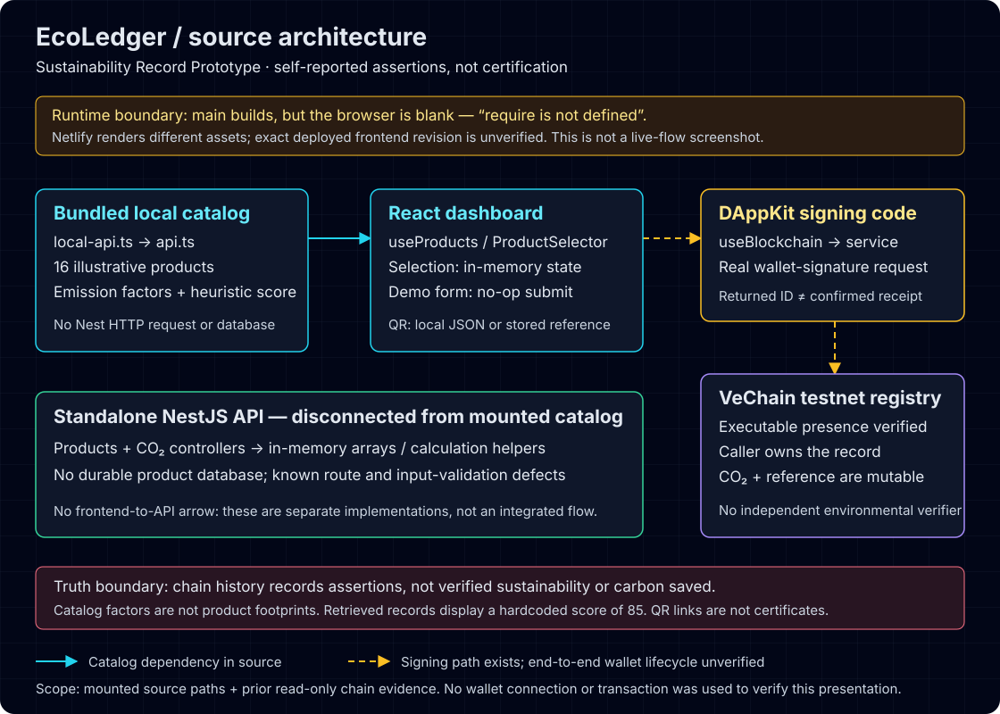

# EcoLedger — Sustainability Record Prototype

A React/TypeScript product-catalog prototype with a Solidity registry on VeChain testnet and a separate NestJS calculation API. Environmental claims are self-reported and not independently verified. The record owner can change claimed CO₂ and transaction references.

The owner confirms this project was submitted to a hackathon. No event, year or award is asserted here.

> **Runtime limitation:** `main` builds, but the browser is blank with `require is not defined`. The [public Netlify UI](https://ecoledger-dapp.netlify.app/) renders different assets; its exact deployed frontend revision is unverified. It is not a verified preview of this source.

## What is here

| Component | Implemented boundary |
| --- | --- |
| React 18 / Vite / TypeScript | Bundled catalog, component-based dashboard, in-memory selection and QR generation. Catalog factors and scores are illustrative. |
| NestJS | The standalone NestJS API is not connected to the mounted catalog. It exposes in-memory product reads and calculation helpers, not database persistence. |
| Solidity / VeChain DAppKit | Real testnet registry and mounted signing code. No end-to-end wallet or receipt-confirmation lifecycle has been proved. |



This is a source-architecture diagram, not a screenshot of a working default-branch app. See [engineering boundaries](docs/engineering.md) for the call paths.

## Inspect and reproduce

Dependency-free presentation checks, from the repository root:

```bash
node --test scripts/test-presentation.mjs
```

These are source-copy assertions, not behavioral integration tests. For a locked frontend build **without loading environment files**, follow [local verification](docs/local-development.md). [Quick start](QUICK_START.md) summarizes the known limits rather than promising a working app.

The testnet registry address is `0x92e647e3bc952154e8336673c4acd1acdcbe63eb`. Read-only inspection matched the deployed runtime to the committed artifact and original compiler build-info; current-source executable parity excludes differing line-ending metadata. See [evidence and gate results](docs/evidence.md).

## Known limits

- “Demo only” form submission invokes a no-op parent callback; nothing is saved. Selecting catalog items only changes React state.
- Catalog emission factors are not measured product footprints. The write path assumes a 1 kg product; retrieved testnet records receive a hardcoded score of **85**. Displayed totals are illustrative, not carbon saved.
- A returned transaction ID is not a confirmed receipt. Stored references are owner-supplied strings; QR codes and explorer links do not certify sustainability or product authenticity.
- Frontend lint/application typecheck fail. Contract tests have **5 passing / 12 failing** because registration arguments are stale. API test/configuration and validation gaps also remain. These are accepted prototype defects, not repaired by this presentation refresh.

## Project history

This repository keeps the complete app. [EcoLedger-LandingPage](https://github.com/SourceSenseiTheRealOne/EcoLedger-LandingPage) is its historical companion, retained separately for archival rather than imported or deleted. It is not an active enterprise offering. The `online-version` branch and existing hosting identities remain separate; neither establishes the Netlify source revision.

Package names, contracts, ABI/build artifacts and deployment records retain their historical identities. This refresh does not add a repository-wide license grant or perform a credential/history review.
